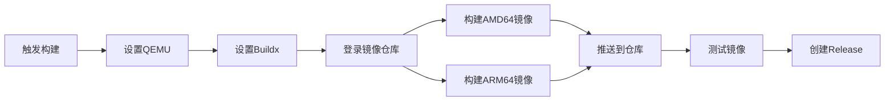

# 🔄 GitHub Actions 工作流说明

## 📋 工作流列表

### 1. docker-build.yml - Docker多架构镜像构建

**功能**: 自动构建并推送AMD64和ARM64双架构Docker镜像

**触发方式**:
- 🏷️ **Tag推送**: 创建版本tag自动触发
- 🖱️ **手动触发**: 在Actions页面手动运行
- 📝 **代码修改**: Dockerfile等文件修改时触发

**支持的架构**:
- ✅ linux/amd64 (x86_64)
- ✅ linux/arm64 (aarch64)

**推送目标**:
- Docker Hub: `zhinianboke/xianyu-auto-reply`
- 阿里云: `registry.cn-shanghai.aliyuncs.com/zhinian-software/xianyu-auto-reply`

## 🚀 使用方法

### 方式1: 通过Git Tag触发

```bash
# 1. 提交代码
git add .
git commit -m "feat: 新功能"

# 2. 创建版本tag
git tag -a v1.0.5 -m "版本 1.0.5"

# 3. 推送tag（自动触发构建）
git push origin v1.0.5
```

**构建时间**: 约15-25分钟（AMD64 + ARM64同时构建）

### 方式2: 手动触发

1. 访问仓库的 **Actions** 标签页
2. 选择 **🐳 Build and Push Multi-Arch Docker Image**
3. 点击 **Run workflow**
4. 输入版本号（例如: 1.0.5）
5. 点击 **Run workflow** 确认

## 🔐 必需的Secrets配置

在仓库的 **Settings → Secrets and variables → Actions** 中配置：

### Docker Hub (国际版)
```
DOCKERHUB_USERNAME=你的Docker Hub用户名
DOCKERHUB_TOKEN=你的Docker Hub访问令牌
```

### 阿里云镜像仓库 (国内版)
```
ALIYUN_USERNAME=你的阿里云账号
ALIYUN_TOKEN=你的阿里云镜像仓库密码
```

## 📦 获取访问令牌

### Docker Hub Token

1. 访问 https://hub.docker.com/settings/security
2. 点击 **New Access Token**
3. 输入Token名称（如: github-actions）
4. 选择权限: **Read, Write, Delete**
5. 复制生成的Token

### 阿里云Token

1. 访问 https://cr.console.aliyun.com/
2. 进入 **访问凭证**
3. 设置或重置密码
4. 使用账号和密码作为Secrets

## 🏗️ 构建流程



## 🧪 测试多架构镜像

构建完成后，工作流会自动测试两个架构的镜像：

```bash
# AMD64测试
docker run --rm --platform linux/amd64 \
  registry.cn-shanghai.aliyuncs.com/zhinian-software/xianyu-auto-reply:latest \
  python --version

# ARM64测试
docker run --rm --platform linux/arm64 \
  registry.cn-shanghai.aliyuncs.com/zhinian-software/xianyu-auto-reply:latest \
  python --version
```

## 📊 查看镜像信息

```bash
# 查看镜像支持的架构
docker manifest inspect registry.cn-shanghai.aliyuncs.com/zhinian-software/xianyu-auto-reply:latest

# 输出示例:
# - linux/amd64
# - linux/arm64
```

## ⚡ 性能优化

### 构建缓存
- ✅ 使用GitHub Actions缓存
- ✅ 多层构建缓存复用
- ✅ 依赖层缓存

### 并行构建
- ✅ AMD64和ARM64并行构建
- ✅ 国际版和国内版并行推送

## 🔍 故障排查

### 构建失败

**问题**: 构建超时或失败
**解决**:
1. 检查Dockerfile语法
2. 查看Actions日志
3. 重新运行工作流

### 推送失败

**问题**: 无法推送到镜像仓库
**解决**:
1. 检查Secrets配置是否正确
2. 验证访问令牌是否有效
3. 检查镜像仓库权限

### ARM64构建慢

**问题**: ARM64构建时间长
**说明**: 这是正常现象，因为使用QEMU模拟ARM架构

## 💡 最佳实践

### 版本号规范

遵循语义化版本：`v主版本.次版本.修订号`

```bash
v1.0.0  # 初始稳定版本
v1.0.1  # Bug修复
v1.1.0  # 新增功能
v2.0.0  # 重大更新
```

### 提交信息规范

```bash
feat: 新功能
fix: Bug修复
docs: 文档更新
perf: 性能优化
chore: 构建/工具

示例:
git commit -m "feat: 添加ARM64架构支持"
git commit -m "fix: 修复Docker容器内存泄漏"
```

### 发布检查清单

- [ ] 代码已测试通过
- [ ] Dockerfile已更新
- [ ] requirements.txt已更新
- [ ] README版本号已更新
- [ ] Secrets配置正确
- [ ] 本地Docker构建测试通过

## 📞 常见问题

**Q: 如何只构建AMD64镜像？**
A: 修改workflow中的platforms参数：
```yaml
platforms: linux/amd64
```

**Q: 如何添加更多架构？**
A: 在platforms中添加，例如：
```yaml
platforms: linux/amd64,linux/arm64,linux/arm/v7
```

**Q: 构建时间太长怎么办？**
A: 
1. 优化Dockerfile减少层数
2. 使用构建缓存
3. 考虑只构建AMD64（ARM64可选）

**Q: 如何验证多架构镜像？**
A: 
```bash
# 查看manifest
docker manifest inspect <镜像名>:latest

# 在不同平台测试
docker run --platform linux/amd64 <镜像名>:latest
docker run --platform linux/arm64 <镜像名>:latest
```

## 📝 更新日志

### 2025-01
- ✅ 添加多架构Docker镜像构建支持
- ✅ 支持AMD64和ARM64架构
- ✅ 自动推送到Docker Hub和阿里云
- ✅ 自动创建Release说明

---

**维护者**: zhinianboke  
**最后更新**: 2025-01

