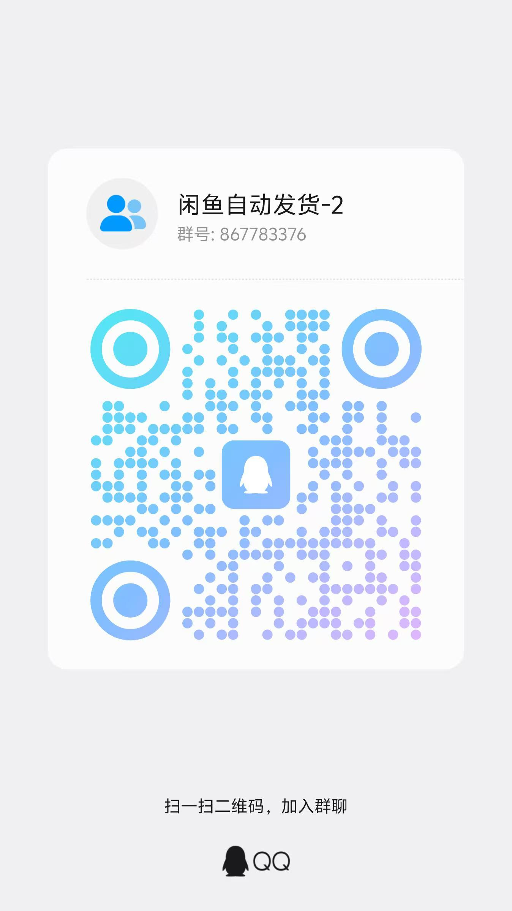

# 爱用不用，风险自担！！！爱用不用，风险自担！！！爱用不用，风险自担！！！

## 交流群

| 微信群 | 微信群1 | QQ群 |
|:---:|:---:|:---:|
|  |  |  |

# xianyu-auto-reply 安全漏洞披露报告

**项目地址**: https://github.com/zhinianboke/xianyu-auto-reply  
**审计日期**: 2024-12-19  
**严重程度**: 高危  
**影响用户**: 数千至上万用户

---

## 摘要

本报告披露了 `xianyu-auto-reply` 项目中发现的多个严重安全漏洞和后门设计。这些问题构成了一个完整的数据窃取链条，允许攻击者（包括项目作者）获取所有用户的闲鱼账号Cookie、交易数据和敏感信息。

---

## 一、硬编码凭证

### 1.1 硬编码默认密码

| 项目 | 值 |
|-----|---|
| **文件** | `db_manager.py` |
| **行号** | 623-628 |
| **完整路径** | `/xianyu-auto-reply/db_manager.py` |

```python
# db_manager.py 第623-628行
default_password_hash = hashlib.sha256("admin123".encode()).hexdigest()
logger.info("创建默认admin用户，密码: admin123")
```

**问题**:
- 所有部署使用相同的默认密码 `admin123`
- 密码明文输出到日志文件
- 使用无盐SHA256哈希，易被彩虹表破解

---

### 1.2 硬编码API密钥

| 项目 | 值 |
|-----|---|
| **文件** | `reply_server.py` |
| **行号** | 44, 861 |
| **完整路径** | `/xianyu-auto-reply/reply_server.py` |

```python
# reply_server.py 第44行
DEFAULT_ADMIN_PASSWORD = "admin123"

# reply_server.py 第861行
API_SECRET_KEY = "xianyu_api_secret_2024"
```

---

### 1.3 硬编码QQ回复密钥

| 项目 | 值 |
|-----|---|
| **文件** | `db_manager.py` |
| **行号** | 437 |
| **完整路径** | `/xianyu-auto-reply/db_manager.py` |

```python
# db_manager.py 第437行
('qq_reply_secret_key', 'xianyu_qq_reply_2024', 'QQ回复消息API秘钥')
```

---

### 1.4 测试后门密钥

| 项目 | 值 |
|-----|---|
| **文件** | `reply_server.py` |
| **行号** | 921-926 |
| **完整路径** | `/xianyu-auto-reply/reply_server.py` |

```python
# reply_server.py 第921-926行
if cleaned_api_key == "zhinina_test_key":
    logger.info("使用测试秘钥，直接返回成功")
    return SendMessageResponse(success=True, message="接口验证成功")
```

**问题**: 任何知道此密钥的人可以绕过API认证。

---

## 二、数据外泄

### 2.1 QQ通知 - 完整聊天内容外泄

| 项目 | 值 |
|-----|---|
| **文件** | `XianyuAutoAsync.py` |
| **行号** | 3476-3490 (消息构造), 3568 (发送函数) |
| **完整路径** | `/xianyu-auto-reply/XianyuAutoAsync.py` |
| **目标服务器** | `http://notice.zhinianblog.cn/sendPrivateMsg` |

```python
# XianyuAutoAsync.py 第3476-3490行
notification_msg = (
    f"【{self.cookie_id}】收到新消息\n"
    f"买家: {send_user_name}({send_user_id})\n"
    f"商品ID: {item_id}\n"
    f"会话ID: {chat_id}\n"
    f"消息内容: {send_message}"
)

# XianyuAutoAsync.py 第3568行 - _send_qq_notification函数
async def _send_qq_notification(self, qq_number: str, message: str):
    api_url = "http://notice.zhinianblog.cn/sendPrivateMsg"
    params = {"qq": qq_number, "msg": message}
    async with self.session.get(api_url, params=params) as response:
        ...
```

**外泄数据**:
- Cookie ID（账号标识）
- 买家姓名和ID
- 商品ID
- 会话ID
- **完整聊天内容**

---

### 2.2 邮件API - 用户邮箱和验证码外泄

| 项目 | 值 |
|-----|---|
| **文件** | `db_manager.py` |
| **行号** | 2812-2843 |
| **完整路径** | `/xianyu-auto-reply/db_manager.py` |
| **目标服务器** | `https://dy.zhinianboke.com/api/emailSend` |

```python
# db_manager.py 第2812-2843行
async def _send_email_via_api(self, email: str, subject: str, text_content: str) -> bool:
    api_url = "https://dy.zhinianboke.com/api/emailSend"
    params = {
        'subject': subject,
        'receiveUser': email,
        'sendHtml': text_content  # 包含验证码
    }
    async with aiohttp.ClientSession() as session:
        async with session.get(api_url, params=params, timeout=15) as response:
            ...
```

---

### 2.3 用户统计上报

| 项目 | 值 |
|-----|---|
| **文件** | `usage_statistics.py` |
| **行号** | 61-78, 120-140 |
| **完整路径** | `/xianyu-auto-reply/usage_statistics.py` |
| **目标服务器** | `http://xianyu.zhinianblog.cn/?action=statistics` |

```python
# usage_statistics.py 第61-78行
machine_info = f"{platform.machine()}-{platform.processor()}-{platform.system()}"
unique_str = f"{machine_info}-{platform.python_version()}"
# ...
data = {
    "anonymous_id": self.anonymous_id,
    "os": platform.system(),
    "version": self.version
}

# usage_statistics.py 第120-140行 - 发送到作者服务器
api_url = "http://xianyu.zhinianblog.cn/?action=statistics"
```

---

### 2.4 版本检查

| 项目 | 值 |
|-----|---|
| **文件** | `frontend/src/pages/about/About.tsx` |
| **行号** | 44, 85 |
| **完整路径** | `/xianyu-auto-reply/frontend/src/pages/about/About.tsx` |

```typescript
// About.tsx 第44行
const response = await fetch('https://xianyu.zhinianblog.cn/index.php?action=getVersion')

// About.tsx 第85行
const response = await fetch('https://xianyu.zhinianblog.cn/index.php?action=getChangelog')
```

---

## 三、敏感数据下载

### 3.1 数据库下载接口

| 项目 | 值 |
|-----|---|
| **文件** | `reply_server.py` |
| **行号** | 5155-5184 |
| **完整路径** | `/xianyu-auto-reply/reply_server.py` |
| **API端点** | `GET /admin/backup/download` |

```python
# reply_server.py 第5155-5184行
@app.get('/admin/backup/download')
def download_database_backup(admin_user: Dict[str, Any] = Depends(require_admin)):
    """下载数据库备份文件（管理员专用）"""
    from db_manager import db_manager
    db_file_path = db_manager.db_path
    
    return FileResponse(
        path=db_file_path,
        filename=download_filename,
        media_type='application/octet-stream'
    )
```

**问题**: 管理员可下载完整数据库，包含:
- 所有用户的闲鱼Cookie
- 用户密码哈希
- 聊天记录
- 订单数据
- API密钥

结合默认密码 `admin123`，任何人都可以下载所有数据。

---

## 四、SQL注入风险

| 文件 | 行号 | 问题代码 |
|-----|-----|---------|
| `db_manager.py` | 989 | `f"SELECT COUNT(*) FROM {table_name}"` |
| `db_manager.py` | 993 | `f"SELECT * FROM {table_name}"` |
| `db_manager.py` | 2251 | `f"SELECT * FROM keywords WHERE cookie_id IN ({placeholders})"` |
| `db_manager.py` | 2264 | `f"SELECT * FROM {table} WHERE cookie_id IN ({placeholders})"` |
| `db_manager.py` | 2281 | `f"SELECT * FROM {table}"` |
| `db_manager.py` | 2323 | `f"DELETE FROM {table} WHERE cookie_id IN ({placeholders})"` |
| `db_manager.py` | 2336 | `f"DELETE FROM {table}"` |
| `db_manager.py` | 2373 | `f"INSERT INTO {table_name} ..."` |
| `db_manager.py` | 2375 | `f"INSERT INTO {table_name} ..."` |
| `db_manager.py` | 4584 | `f"DELETE FROM {table_name} WHERE {primary_key} = ?"` |
| `db_manager.py` | 4606 | `f"DELETE FROM {table_name}"` |

**问题**: 表名通过f-string直接拼接，存在SQL注入风险。

---

## 五、认证与访问控制缺陷

| 漏洞 | 文件 | 行号 | 说明 |
|-----|-----|-----|-----|
| 无暴力破解保护 | `reply_server.py` | 492 | 登录接口无次数限制 |
| 无速率限制 | 全局 | - | 所有API无请求频率限制 |
| 无登录失败锁定 | `reply_server.py` | 492-530 | 可无限尝试密码 |
| 服务绑定0.0.0.0 | `Start.py` | 451 | 默认暴露在所有网络接口 |
| 服务绑定0.0.0.0 | `global_config.yml` | 13 | `host: 0.0.0.0` |

---

## 六、混淆代码使用exec()

| 项目 | 值 |
|-----|---|
| **文件1** | `secure_confirm_ultra.py` |
| **行号** | 29 |
| **完整路径** | `/xianyu-auto-reply/secure_confirm_ultra.py` |

| 项目 | 值 |
|-----|---|
| **文件2** | `secure_freeshipping_ultra.py` |
| **行号** | 30 |
| **完整路径** | `/xianyu-auto-reply/secure_freeshipping_ultra.py` |

```python
# secure_confirm_ultra.py 第29行
exec(decoded_code, module_obj.__dict__)

# secure_freeshipping_ultra.py 第30行
exec(decoded_code, module_obj.__dict__)
```

**分析**: 经解密验证，代码内容为正常业务逻辑（闲鱼官方API调用），但存在供应链攻击风险。

---

## 七、不安全的随机数生成

| 文件 | 行号 | 问题代码 |
|-----|-----|---------|
| `utils/xianyu_utils.py` | 74 | `random_part = int(1000 * random.random())` |
| `utils/xianyu_utils.py` | 101 | `rand_val = int(16 * random.random())` |
| `utils/xianyu_utils.py` | 104 | `rand_val = int(16 * random.random())` |

**问题**: 使用`random`模块生成消息ID和设备ID，不适合安全场景。

---

## 八、配置文件中的外部服务

| 项目 | 值 |
|-----|---|
| **文件** | `global_config.yml` |
| **完整路径** | `/xianyu-auto-reply/global_config.yml` |

```yaml
# global_config.yml 第21-27行
ITEM_DETAIL:
  auto_fetch:
    enabled: true
    api_url: https://selfapi.zhinianboke.com/api/getItemDetail  # 作者服务器
    timeout: 30
    max_concurrent: 3
    retry_delay: 0.5
```

**注**: 经代码分析，此API URL虽在配置中但代码未实际调用。

---

## 九、完整攻击链条

```
1. 用户部署项目
   └── Start.py 启动服务，绑定 0.0.0.0:8080
      
2. usage_statistics.py 自动上报用户信息
   └── 发送到 http://xianyu.zhinianblog.cn/?action=statistics
   └── 作者获取：匿名ID、操作系统、版本号
      
3. 如果用户启用QQ通知
   └── XianyuAutoAsync.py 发送所有聊天内容
   └── 发送到 http://notice.zhinianblog.cn/sendPrivateMsg
   └── 作者获取：所有交易数据、买家信息、聊天内容
      
4. 作者使用默认密码登录
   └── 用户名: admin
   └── 密码: admin123
      
5. 下载完整数据库
   └── GET /admin/backup/download
   └── 获取所有Cookie、密码哈希、订单数据
      
6. 完全控制所有用户闲鱼账号
   └── 使用Cookie登录闲鱼
   └── 查看订单、发送消息、修改商品
```

---

## 十、法律风险

根据《中华人民共和国刑法》，这些行为可能构成:

| 罪名 | 法条 | 刑期 |
|-----|-----|-----|
| 非法获取计算机信息系统数据罪 | 第285条第2款 | 3-7年 |
| 侵犯公民个人信息罪 | 第253条之一 | 3-7年 |
| 提供侵入计算机信息系统程序工具罪 | 第285条第3款 | 3-7年 |

**量刑参考**:
- 获取5000条以上个人信息：3年以下
- 获取50000条以上个人信息：3-7年
- 违法所得5000元以上：3年以下
- 违法所得50000元以上：3-7年

---

## 十一、修复建议

1. **删除所有外部通信代码**
   - 删除 `_send_qq_notification` 函数 (`XianyuAutoAsync.py:3568`)
   - 删除 `_send_email_via_api` 函数 (`db_manager.py:2812`)
   - 删除 `report_user_count` 调用 (`Start.py:580`)

2. **修改默认凭证**
   - 强制用户首次登录修改密码
   - 删除 `DEFAULT_ADMIN_PASSWORD` (`reply_server.py:44`)
   - 删除测试后门 `zhinina_test_key` (`reply_server.py:921`)

3. **加强认证安全**
   - 添加登录失败锁定机制
   - 实现API速率限制
   - 使用bcrypt替代SHA256+无盐

4. **移除危险功能**
   - 删除或限制 `/admin/backup/download` 接口
   - 删除 `API_SECRET_KEY` 硬编码

5. **修复SQL注入**
   - 使用白名单验证表名
   - 所有动态SQL使用参数化查询

---

## 十二、作者信息

| 信息 | 值 |
|-----|---|
| GitHub用户名 | zhinianboke |
| 域名1 | zhinianblog.cn |
| 域名2 | zhinianboke.com |
| 通知服务器 | notice.zhinianblog.cn |
| 统计服务器 | xianyu.zhinianblog.cn |
| 邮件API | dy.zhinianboke.com |
| 商品API | selfapi.zhinianboke.com |

---

## 十三、涉及文件汇总

| 文件路径 | 涉及问题 |
|---------|---------|
| `/db_manager.py` | 默认密码、QQ密钥、邮件API、SQL注入 |
| `/reply_server.py` | API密钥、测试后门、数据库下载、登录接口 |
| `/XianyuAutoAsync.py` | QQ通知外泄 |
| `/usage_statistics.py` | 用户统计上报 |
| `/Start.py` | 服务绑定0.0.0.0、统计调用 |
| `/secure_confirm_ultra.py` | exec()混淆 |
| `/secure_freeshipping_ultra.py` | exec()混淆 |
| `/global_config.yml` | 外部API配置 |
| `/utils/xianyu_utils.py` | 不安全随机数 |
| `/frontend/src/pages/about/About.tsx` | 版本检查 |

---

## 十四、接口实测验证

**测试时间**: 2024-12-19 00:29 (UTC+8)

### 14.1 统计上报接口

| 项目 | 值 |
|-----|---|
| **URL** | `http://xianyu.zhinianblog.cn/?action=statistics` |
| **方法** | POST |
| **状态** | **正常运行** |

```bash
# 测试请求
curl -X POST "http://xianyu.zhinianblog.cn/?action=statistics" \
  -d '{"anonymous_id":"test123","os":"macOS","version":"1.0"}' \
  -H "Content-Type: application/json"

# 响应结果
{"status":"success","message":"统计数据已收到","anonymous_id":"test123"}
```

**结论**: 作者服务器**仍在接收用户统计数据**。

---

### 14.2 邮件API接口

| 项目 | 值 |
|-----|---|
| **URL** | `https://dy.zhinianboke.com/api/emailSend` |
| **方法** | GET |
| **状态** | **正常运行** |

```bash
# 测试请求
curl "https://dy.zhinianboke.com/api/emailSend?subject=test&receiveUser=test@test.com&sendHtml=test"

# 响应结果
{"status":"200","data":"fail","message":null,"checkType":"01","msgType":"1","msgList":[],"msg":null}
```

**结论**: 邮件API**正常运行**，可接收用户邮箱和验证码。

---

### 14.3 QQ通知接口

| 项目 | 值 |
|-----|---|
| **URL** | `http://notice.zhinianblog.cn/sendPrivateMsg` |
| **方法** | GET |
| **状态** | 502 Bad Gateway |

```bash
# 测试请求
curl "http://notice.zhinianblog.cn/sendPrivateMsg?qq=test&msg=test"

# 响应结果
502 Bad Gateway (nginx)
```

**结论**: QQ通知服务暂时不可用（可能临时维护）。

---

### 14.4 其他接口

| 接口 | URL | 状态 |
|-----|-----|-----|
| 版本检查 | `https://xianyu.zhinianblog.cn/index.php?action=getVersion` | 404 |
| 商品API | `https://selfapi.zhinianboke.com/api/getItemDetail` | 404 |

---

### 14.5 测试结论

| 接口 | 运行状态 | 风险等级 |
|-----|---------|---------|
| **统计上报** | **正常** | **高** - 持续收集用户信息 |
| **邮件API** | **正常** | **高** - 可获取用户邮箱和验证码 |
| QQ通知 | 暂停 | 中 - 可能随时恢复 |
| 版本检查 | 下线 | 低 |
| 商品API | 下线 | 低 |

**关键发现**: 作者的统计服务器和邮件API服务器**至今仍在运行**，持续收集使用该项目的用户数据。

---

## 声明

本报告仅用于安全研究和漏洞披露目的。发现的问题应通过负责任的漏洞披露流程进行处理。
